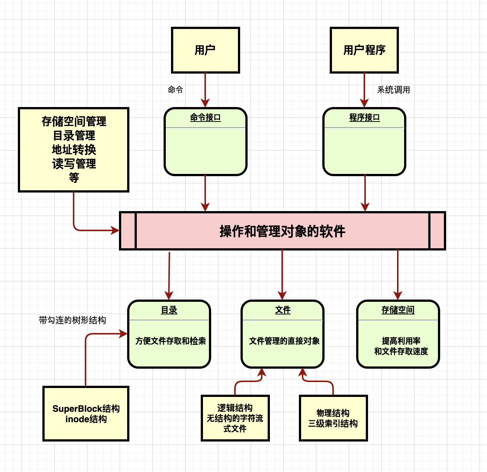

# 操作系统课程设计UNIX文件系统

## 一、需求分析

本操作系统课程设计的主要任务概括来说主要是使用一个被称为一级文件的普通大文件来模拟UNIX V6++的一个文件卷，一个文件卷实际上就是一张逻辑磁盘，磁盘中存储的信息以块为单位，每块512字节。


因此我们需要实现的基础内容主要有以下五个方面：

1. 磁盘文件结构
2. 文件目录结构
3. 文件打开结构
4. 文件操作接口
5. 主程序

此外，选择了以下两个内容作为选做内容：

1. 磁盘高速缓存
2. 多用户同时访问二级文件系统**（잠시 자료는 없음）**

**（수입/수출 형식과 프로그램의 기능은 없음）**

## 二、概要设计

### 2.1 文件系统整体功能

1. 按用户要求创建文件
2. 按用户要求进行文件读写
3. 用户使用文件符号名实现文件访问
4. 管理文件存储空间，自动分配，建立文件逻辑结构以及物理结构之间的映照关系
5. 维护文件
6. 共享和保密（？）

### 2.2 文件系统模型



### 2.3 文件系统类图

### 2.4 SuperBlock文件系统存储资源管理块类

```c++
class SuperBlock
{
	/* 方法 */
public:
	/* 构造函数 */
	SuperBlock();
	/* 析构函数 */
	~SuperBlock();
	
	/* 属性 */
public:
	int		s_isize;		/* 外存Inode区占用的盘块数 */
	int		s_fsize;		/* 盘块总数 */
	
	int		s_nfree;		/* 直接管理的空闲盘块数量 */
	int		s_free[100];	/* 直接管理的空闲盘块索引表 */
	
	int		s_ninode;		/* 直接管理的空闲外存Inode数量 */
	int		s_inode[100];	/* 直接管理的空闲外存Inode索引表 */
	
	int		s_flock;		/* 封锁空闲盘块索引表标志 */
	int		s_ilock;		/* 封锁空闲Inode表标志 */
	
	int		s_fmod;			/* 内存中super block副本被修改标志，意味着需要更新外存对应的Super Block */
	int		s_ronly;		/* 本文件系统只能读出 */
	int		s_time;			/* 最近一次更新时间 */
	int		padding[47];	/* 填充使SuperBlock块大小等于1024字节，占据2个扇区 */
};
```

### 2.5 Inode内存索引节点类

```c++
class Inode
{
public:
	/* i_flag中标志位 */
	enum INodeFlag
	{
		ILOCK = 0x1,		/* 索引节点上锁 */
		IUPD  = 0x2,		/* 内存inode被修改过，需要更新相应外存inode */
		IACC  = 0x4,		/* 内存inode被访问过，需要修改最近一次访问时间 */
		IMOUNT = 0x8,		/* 内存inode用于挂载子文件系统 */
		IWANT = 0x10,		/* 有进程正在等待该内存inode被解锁，清ILOCK标志时，要唤醒这种进程 */
		ITEXT = 0x20		/* 内存inode对应进程图像的正文段 */
	};
	
	/* 静态常属性 */
	static const unsigned int IALLOC = 0x8000;		/* 文件被使用 */
	static const unsigned int IFMT = 0x6000;		/* 文件类型掩码 */
	static const unsigned int IFDIR = 0x4000;		/* 文件类型：目录文件 */
	static const unsigned int IFCHR = 0x2000;		/* 字符设备特殊类型文件 */
	static const unsigned int IFBLK = 0x6000;		/* 块设备特殊类型文件，为0表示常规数据文件 */
	static const unsigned int ILARG = 0x1000;		/* 文件长度类型：大型或巨型文件 */
	static const unsigned int ISUID = 0x800;		/* 执行时文件时将用户的有效用户ID修改为文件所有者的User ID */
	static const unsigned int ISGID = 0x400;		/* 执行时文件时将用户的有效组ID修改为文件所有者的Group ID */
	static const unsigned int ISVTX = 0x200;		/* 使用后仍然位于交换区上的正文段 */
	static const unsigned int IREAD = 0x100;		/* 对文件的读权限 */
	static const unsigned int IWRITE = 0x80;		/* 对文件的写权限 */
	static const unsigned int IEXEC = 0x40;			/* 对文件的执行权限 */
	static const unsigned int IRWXU = (IREAD|IWRITE|IEXEC);		/* 文件主对文件的读、写、执行权限 */
	static const unsigned int IRWXG = ((IRWXU) >> 3);			/* 文件主同组用户对文件的读、写、执行权限 */
	static const unsigned int IRWXO = ((IRWXU) >> 6);			/* 其他用户对文件的读、写、执行权限 */
	
	static const int BLOCK_SIZE = 512;		/* 文件逻辑块大小: 512字节 */
	static const int ADDRESS_PER_INDEX_BLOCK = BLOCK_SIZE / sizeof(int);	/* 每个间接索引表(或索引块)包含的物理盘块号 */

	static const int SMALL_FILE_BLOCK = 6;	/* 小型文件：直接索引表最多可寻址的逻辑块号 */
	static const int LARGE_FILE_BLOCK = 128 * 2 + 6;	/* 大型文件：经一次间接索引表最多可寻址的逻辑块号 */
	static const int HUGE_FILE_BLOCK = 128 * 128 * 2 + 128 * 2 + 6;	/* 巨型文件：经二次间接索引最大可寻址文件逻辑块号 */

	static const int PIPSIZ = SMALL_FILE_BLOCK * BLOCK_SIZE;

	/* 静态属性 */
	static int rablock;		/* 顺序读时，使用预读技术读入文件的下一字符块，rablock记录了下一逻辑块号
							经过bmap转换得到的物理盘块号。将rablock作为静态变量的原因：调用一次bmap的开销
							对当前块和预读块的逻辑块号进行转换，bmap返回当前块的物理盘块号，并且将预读块
							的物理盘块号保存在rablock中。 */
	
	/* 方法 */
public:
	/* 构造函数 */
	Inode();
	/* 析构函数 */
	~Inode();
	
	void ReadI();                       /* 根据Inode对象中的物理磁盘块索引表，读取相应的文件数据 */
	void WriteI();                      /* 根据Inode对象中的物理磁盘块索引表，将数据写入文件 */
	int Bmap(int lbn);                  /* 将文件的逻辑块号转换成对应的物理盘块号 */
	void OpenI(int mode);               /* 对特殊字符设备、块设备文件，调用该设备注册在块设备开关表中的设备初始化程序 */
	void CloseI(int mode);              /* 对特殊字符设备、块设备文件。如果对该设备的引用计数为0，则调用该设备的关闭程序 */
	void IUpdate(int time);             /* 更新外存Inode的最后的访问时间、修改时间 */
	void ITrunc();                      /* 释放Inode对应文件占用的磁盘块 */
	void Prele();                       /* 对Pipe或者Inode解锁，并且唤醒因等待锁而睡眠的进程 */	
	void Plock();                       /* 对Pipe上锁，如果Pipe已经被上锁，则增设IWANT标志并睡眠等待直至解锁 */
	void NFrele();                      /* 对Pipe或者Inode解锁，并且唤醒因等待锁而睡眠的进程 */
	void NFlock();                      /* 对Pipe上锁，如果Pipe已经被上锁，则增设IWANT标志并睡眠等待直至解锁 */	
	void Clean();                       /* 清空Inode对象中的数据 */
	void ICopy(Buf* bp, int inumber);   /* 将包含外存Inode字符块中信息拷贝到内存Inode中 */
	
	/* 属性 */
public:
	unsigned int i_flag;	/* 状态的标志位，定义见enum INodeFlag */
	unsigned int i_mode;	/* 文件工作方式信息 */
	
	int		i_count;		/* 引用计数 */
	int		i_nlink;		/* 文件联结计数，即该文件在目录树中不同路径名的数量 */
	
	short	i_dev;			/* 外存inode所在存储设备的设备号 */
	int		i_number;		/* 外存inode区中的编号 */
	
	short	i_uid;			/* 文件所有者的用户标识数 */
	short	i_gid;			/* 文件所有者的组标识数 */
	
	int		i_size;			/* 文件大小，字节为单位 */
	int		i_addr[10];		/* 用于文件逻辑块好和物理块好转换的基本索引表 */
	
	int		i_lastr;		/* 存放最近一次读取文件的逻辑块号，用于判断是否需要预读 */
};
```

### 2.6 InodeTable内存Inode表类

```c++
class InodeTable
{
	/* 静态常属性 */
public:
	static const int NINODE	= 100;	/* 内存Inode的数量 */
	
	/* 方法 */
public:
	/* 构造函数 */
	InodeTable();
	/* 析构函数 */
	~InodeTable();
	
	void Initialize();                      /* 初始化对g_FileSystem对象的引用 */
	Inode* IGet(short dev, int inumber);    /* 根据指定设备号dev，外存Inode编号获取对应
	                                         * Inode。如果该Inode已经在内存中，对其上锁并返回该内存Inode，
	                                         * 如果不在内存中，则将其读入内存后上锁并返回该内存Inode */
	void IPut(Inode* pNode);                /* 减少该内存Inode的引用计数，如果此Inode已经没有目录项指向它，
	                                         * 且无进程引用该Inode，则释放此文件占用的磁盘块。 */
	void UpdateInodeTable();                /* 将所有被修改过的内存Inode更新到对应外存Inode中 */
	int IsLoaded(short dev, int inumber);   /* 检查设备dev上编号为inumber的外存inode是否有内存拷贝，
	                                         * 如果有则返回该内存Inode在内存Inode表中的索引 */
	Inode* GetFreeInode();                  /* 在内存Inode表中寻找一个空闲的内存Inode */
	
	/* 属性 */
public:
	Inode m_Inode[NINODE];		/* 内存Inode数组，每个打开文件都会占用一个内存Inode */
	FileSystem* m_FileSystem;	/* 对全局对象g_FileSystem的引用 */
};
```

### 2.6 DiskInode外存索引节点类

```c++
class DiskInode
{
	/* 方法 */
public:
	/* 构造函数 */
	DiskInode();
	/* 析构函数 */
	~DiskInode();

	/* 属性 */
public:
	unsigned int d_mode;	/* 状态的标志位，定义见enum INodeFlag */
	int		d_nlink;		/* 文件联结计数，即该文件在目录树中不同路径名的数量 */
	
	short	d_uid;			/* 文件所有者的用户标识数 */
	short	d_gid;			/* 文件所有者的组标识数 */
	
	int		d_size;			/* 文件大小，字节为单位 */
	int		d_addr[10];		/* 用于文件逻辑块好和物理块好转换的基本索引表 */
	
	int		d_atime;		/* 最后访问时间 */
	int		d_mtime;		/* 最后修改时间 */
};
```

### 2.7 Buf磁盘控制块类

```c++
class Buf
{
public:
	enum BufFlag	/* b_flags中标志位 */
	{
		B_WRITE = 0x1,		/* 写操作。将缓存中的信息写到硬盘上去 */
		B_READ	= 0x2,		/* 读操作。从盘读取信息到缓存中 */
		B_DONE	= 0x4,		/* I/O操作结束 */
		B_ERROR	= 0x8,		/* I/O因出错而终止 */
		B_BUSY	= 0x10,		/* 相应缓存正在使用中 */
		B_WANTED = 0x20,	/* 有进程正在等待使用该buf管理的资源，清B_BUSY标志时，要唤醒这种进程 */
		B_ASYNC	= 0x40,		/* 异步I/O，不需要等待其结束 */
		B_DELWRI = 0x80		/* 延迟写，在相应缓存要移做他用时，再将其内容写到相应块设备上 */
	};
	
public:
	unsigned int b_flags;	/* 缓存控制块标志位 */
	
	int		padding;		/* 4字节填充，使得b_forw和b_back在Buf类中与Devtab类
							 * 中的字段顺序能够一致，否则强制转换会出错。 */
	/* 缓存控制块队列勾连指针 */
	Buf*	b_forw;
	Buf*	b_back;
	Buf*	av_forw;
	Buf*	av_back;
	
	short	b_dev;			/* 主、次设备号，其中高8位是主设备号，低8位是次设备号 */
	int		b_wcount;		/* 需传送的字节数 */
	unsigned char* b_addr;	/* 指向该缓存控制块所管理的缓冲区的首地址 */
	int		b_blkno;		/* 磁盘逻辑块号 */
	int		b_error;		/* I/O出错时信息 */
	int		b_resid;		/* I/O出错时尚未传送的剩余字节数 */
};
```

### 2.8 BufferManager缓存块管理类

```c++
class BufferManager
{
public:
	/* 静态常属性 */
	static const int NBUF = 15;			/* 缓存控制块、缓冲区的数量 */
	static const int BUFFER_SIZE = 512;	/* 缓冲区大小。 以字节为单位 */

    /* 方法 */
public:
    /* 构造函数 */
	BufferManager();
    /* 析构函数 */
	~BufferManager();
	
	void Initialize();					/* 缓存控制块队列的初始化。将缓存控制块中b_addr指向相应缓冲区首地址。*/
	
	Buf* GetBlk(short dev, int blkno);	/* 申请一块缓存，用于读写设备dev上的字符块blkno。*/
	void Brelse(Buf* bp);				/* 释放缓存控制块buf */
	void IOWait(Buf* bp);				/* 同步方式I/O，等待I/O操作结束 */
	void IODone(Buf* bp);				/* I/O操作结束善后处理 */

	Buf* Bread(short dev, int blkno);	/* 读一个磁盘块。dev为主、次设备号，blkno为目标磁盘块逻辑块号。 */
	Buf* Breada(short adev, int blkno, int rablkno);	/* 读一个磁盘块，带有预读方式。
														 * adev为主、次设备号。blkno为目标磁盘块逻辑块号，同步方式读blkno。
														 * rablkno为预读磁盘块逻辑块号，异步方式读rablkno。 */
	void Bwrite(Buf* bp);				/* 写一个磁盘块 */
	void Bdwrite(Buf* bp);				/* 延迟写磁盘块 */
	void Bawrite(Buf* bp);				/* 异步写磁盘块 */

	void ClrBuf(Buf* bp);				/* 清空缓冲区内容 */
	void Bflush(short dev);				/* 将dev指定设备队列中延迟写的缓存全部输出到磁盘 */
	bool Swap(int blkno, unsigned long addr, int count, enum Buf::BufFlag flag);
										/* Swap I/O 用于进程图像在内存和盘交换区之间传输
										 * blkno: 交换区中盘块号；addr:  进程图像(传送部分)内存起始地址；
										 * count: 进行传输字节数，byte为单位；传输方向flag: 内存->交换区 or 交换区->内存。 */
	Buf& GetSwapBuf();					/* 获取进程图像传送请求块Buf对象引用 */
	Buf& GetBFreeList();				/* 获取自由缓存队列控制块Buf对象引用 */

private:
	void GetError(Buf* bp);				/* 获取I/O操作中发生的错误信息 */
	void NotAvail(Buf* bp);				/* 从自由队列中摘下指定的缓存控制块buf */
	Buf* InCore(short adev, int blkno);	/* 检查指定字符块是否已在缓存中 */
	
private:
	Buf bFreeList;						/* 自由缓存队列控制块 */
	Buf SwBuf;							/* 进程图像传送请求块 */
	Buf m_Buf[NBUF];					/* 缓存控制块数组 */
	unsigned char Buffer[NBUF][BUFFER_SIZE];	/* 缓冲区数组 */
};
```

### 2.9 BlockDevice块设备类

```c++
class BlockDevice
{
private:
    /* 方法 */
public:
    /* 构造函数 */
    BlockDevice();
    /* 析构函数 */
    ~BlockDevice();

    void write(char *buf, int buf_size, int offset);    /* 向块设备写入 */
    void read(char *buf, int buf_size, int offset);     /* 从块设备读取 */
};
```

### 2.10 DeviceManager设备管理类

```c++
class DeviceManager
{
	/* 静态常属性 */
public:
	static const int MAX_DEVICE_NUM = 10;	/* 系统允许最大块设备数量 */
	static const int NODEV = -1;	/* NODEV设备号 */

	static const short ROOTDEV = (0 << 8) | 0;	/* 磁盘的主、从设备号都为0 */

public:
	DeviceManager();
	~DeviceManager();

	/* 初始化块设备基类指针数组。相当于是对块设备开关表bdevsw的初始化。*/
	void Initialize();

	int GetNBlkDev();							/* 获取系统中实际块设备数量nblkdev */
	BlockDevice& GetBlockDevice(short major);	/* 根据主设备号major获取相应块设备对象实例 */
private:
	int nblkdev;							/* 系统中块设备的数量 @line 4631 */
	BlockDevice *bdevsw[MAX_DEVICE_NUM];	/* 指向块设备基类的指针数组，相当于Unix V6中块设备开关表 */
};
```

### 2.11 File文件控制块类

```c++
class File
{
public:
	enum FileFlags
	{
		FREAD = 0x1,			/* 读请求类型 */
		FWRITE = 0x2,			/* 写请求类型 */
		FPIPE = 0x4				/* 管道类型 */
	};
	
	/* 方法 */
public:
	/* 构造函数 */
	File();
	/* 析构函数 */
	~File();
  
	/* 属性 */
	unsigned int f_flag;		/* 对打开文件的读、写操作要求 */
	int		f_count;			/* 当前引用该文件控制块的进程数量 */
	Inode*	f_inode;			/* 指向打开文件的内存Inode指针 */
	int		f_offset;			/* 文件读写位置指针 */
};
```

### 2.9 UserInterface用户接口类

```c++
class UserInterface
{
private:
    vector<string> DealInput(const string s, const string devider); /* 处理输入的字符串，分析命令和参数 */
  
public:
    /* 构造函数 */
    UserInterface();
    /* 析构函数 */
    ~UserInterface();

    void GetCmd(string user_name);  /* 等待用户输入命令 */
    void ProcessCmd(string input);  /* 处理用户输入的命令 */

    void fformat();                     /* 格式化文件卷
                                         * 命令格式 : fformat */
    set<string> ls();                   /* 列出当前目录下的所有文件和文件夹
                                         * 命令格式 : ls */
    int mkdir(string dir_name);         /* 在当前目录下创建文件夹
                                         * 命令格式 : mkdir <dir_name> */
    int fcreat(string f_name);          /* 创建文件
                                         * 命令格式 : fcreat <f_name> */
    int fopen(string f_name);           /* 打开文件
                                         * 命令格式 : fopen <f_name> */
    void fclose();                      /* 关闭文件
                                         * 命令格式 : fclose <f_name> */
    int fdelete(string f_name);         /* 删除文件
                                         * 命令格式 : fdelete <f_name> */
    int fread(char *buf, int length);   /* 读取文件
                                         * 命令格式 : fread <buf><length> */
    int fwrite(char *buf, int length);  /* 写入文件
                                         * 命令格式 : fwrite <buf><length> */
    void flseek(int offset);            /* 定位文件读写指针
                                         * 命令格式 : flseek <offset> */
    
    void help();                        /* 获取帮助
                                         * 命令格式 : help */
    int cd(string dir_name);            /* 更换路径
                                         * 命令格式 : cd <sir_name>*/
};
```


### 2.10 


## 三、详细设计

## 四、调试分析

## 五、用户使用说明

## 六、运行结果分析

## 七、实验总结

## 八、参考文献

1. 